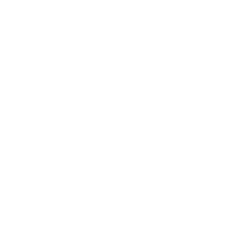

	

<h3 align="center">Node Finite State Machine</h3>

Similar Addons
- https://github.com/ninetailsrabbit/node-finite-state-machine
- https://github.com/imjp94/gd-YAFSM
- https://github.com/lowlevel-1989/object_state_machine

La maquina de estados es un nodo (componente) que tiene una lista de scripts de estados expuesta

## ¿Cómo usarlo?

En tu nodo crea un StateMachine
Crea los scripts de los estados y añadelos al StateMachine
En su interfaz conecta los estados entre si como lo necesites

### ¿Cómo funciona?

#### Funcionamiento general

El state machine crea los estados en base a los scripts

En el apartado visual cada vez que se seleccione un nodo del tipo StateMachine se abrira una ventana nueva donde apareceran los nodos graficos con sus respectivos Inputs y Outputs, podras conectarlos entre si, respetaran el tipo que les diste y siempre podran conectarse al tipo de Input 0.
Una vez finalizado las conexiones podras iniciar tu proyecto

#### Detalles

Los Inputs y Outputs son RefCounted que debes crear y añadir dentro de la función **init()** del estado

